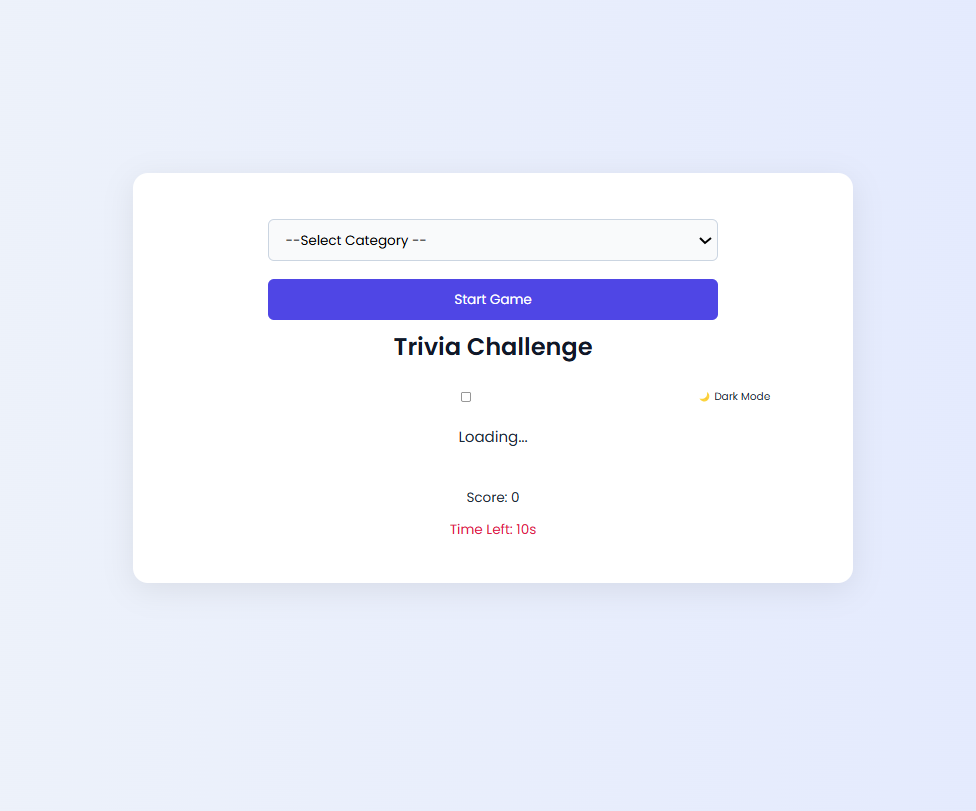
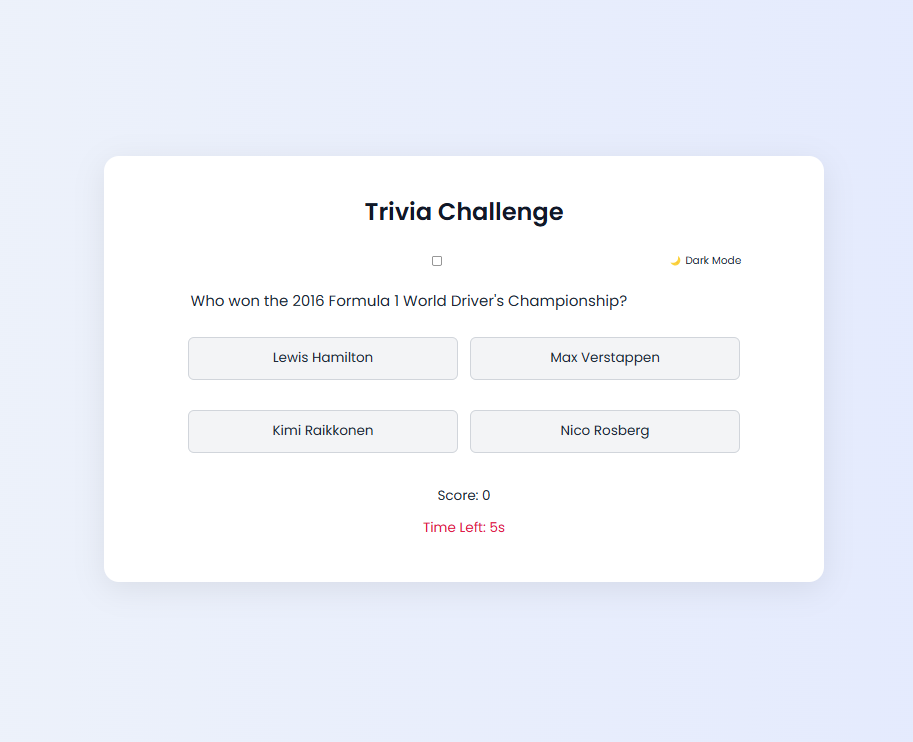
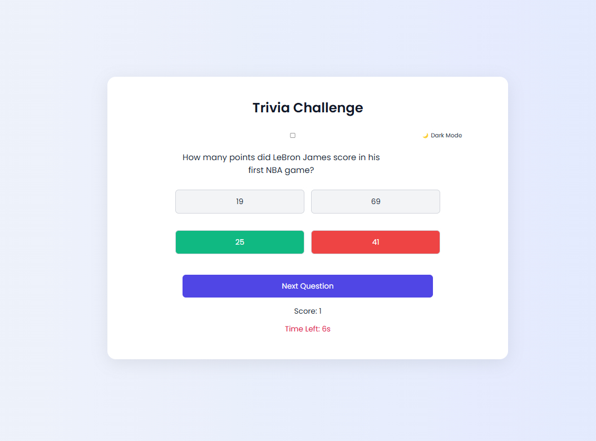
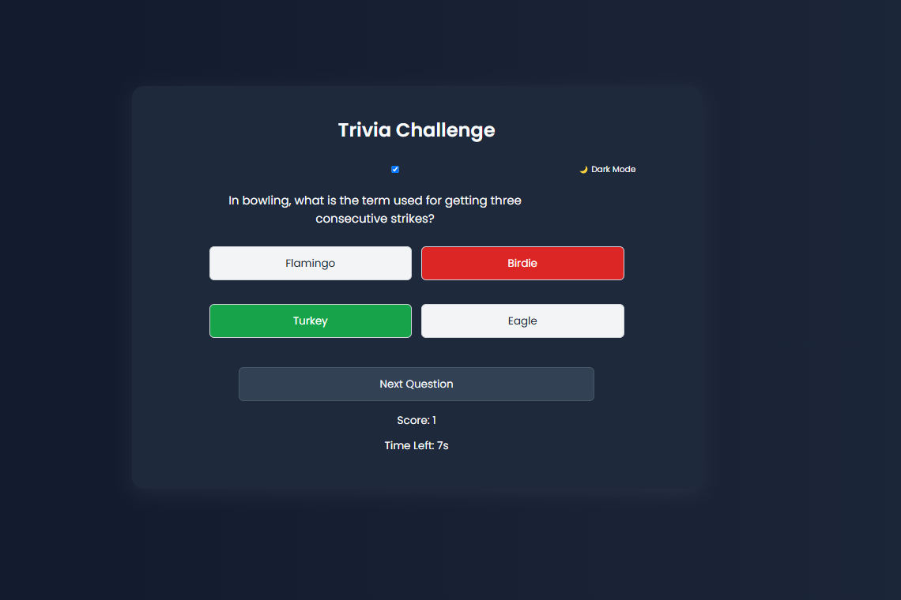
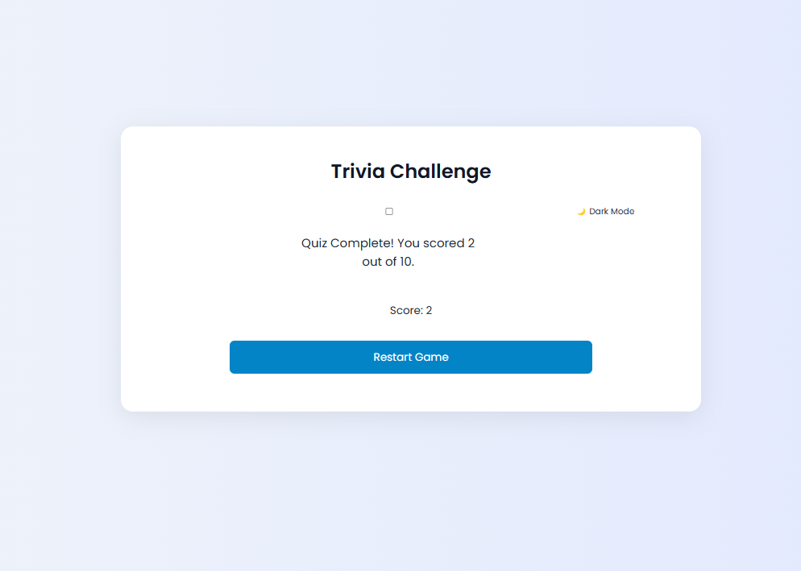

## Trivia Project
A timed, category-based quiz web application that allows users to test their knowledge across multiple subjects. Users can toggle between light and dark modes, answer multiple-choice questions, and track their score in real-time

## 📑 Table of Contents

- [Trivia Project](#trivia-project)
- [Introduction](#-introduction)
- [Features](#-features)
- [Screenshots](#-screenshots)
- [Installation & Setup](#️-installation--setup)
- [Technologies Used](#️-technologies-used)
- [Usage](#-usage)
- [Limitations](#limitations)
- [Learning Goals](#-learning-goals)
- [Live Site](#live-site)
- [Author](#-author)


## 🧠 Introduction
The **Trivia Project** is a single-page quiz web application built using vanilla HTML, CSS, and JavaScript. It allows users to select a question category and engage in a timed quiz session powered by the Open Trivia API. The app features real-time score tracking, interactive feedback on correct/incorrect answers, and a dynamic user interface with optional dark mode for accessibility. The goal is to provide an engaging way to test general knowledge while applying core front-end development concepts.

## ✨ Features
- 🎯 **Category Selection** – Choose from multiple trivia categories like General Knowledge, Science, Geography, etc.  
- ⏱️ **Countdown Timer** – Each question has a 10-second countdown to encourage quick thinking.  
- ✅ **Answer Validation** – Instant feedback highlighting correct and incorrect answers.  
- 🌗 **Dark Mode Toggle** – Switch between light and dark themes for visual comfort.  
- 🔄 **Restart Option** – Restart the quiz anytime after completing all questions.  
- 🎮 **Keyboard Shortcuts** – Press `Enter` to proceed to the next question.  
- 📊 **Real-Time Score** – Track your performance throughout the quiz.  
- ⚙️ **Responsive Design** – Fully functional across desktop and mobile devices.

## 📸 Screenshots

| UI View | Description |
|--------|-------------|
|  | **Start screen** with category selection and “Start Game” button. |
|  | **Trivia question view** showing a question, multiple choices, and timer. |
|  | **Answer selection feedback** showing correct/incorrect highlight. |
|  | **Dark mode activated** showing the interface with dark theme. |
|  | **Quiz completion screen** displaying final score and restart button. |

## ⚙️ Installation & Setup
To run this trivia app locally on your machine, follow these steps:

1. **Clone the Repository**  
   ```bash
   git@github.com:Moringa-SDF-PT10/edgar-mikuro-trivia-project.git
   ```

2. **Navigate into the project folder**  
   ```bash
   cd edgar-mikuro-trivia-project
   ```

3. **Open with Live Server**  
   If you're using VS Code, right-click on `index.html` and select `Open with Live Server`.

4. ✅ That’s it! The trivia game will load in your browser and be ready to play.

## 🛠️ Technologies Used
The Trivia App was built using the following core web technologies:

- **HTML5** – For creating the structure of the web application  
- **CSS3** – For responsive and modern styling (includes light/dark mode theming)  
- **JavaScript (ES6+)** – For interactive functionality such as fetching questions, handling answers, and managing the timer  
- **Open Trivia DB API** – External API used to fetch random multiple-choice trivia questions  
- **Visual Studio Code** – Development environment with Live Server extension  
- **Git & GitHub** – Version control and remote code repository  

## 🎮 Usage
Follow the steps below to play the Trivia Challenge:

1. **Select a Category** – Choose from General Knowledge, Sports, History, etc.  
2. **Click "Start Game"** – The first question will be fetched and displayed.  
3. **Answer the Question** – Click one of the multiple-choice options. Your answer will be marked correct (✅ green) or incorrect (❌ red).  
4. **Timer** – You have 10 seconds to answer each question before it's auto-graded.  
5. **Score Display** – Your current score is updated after every question.  
6. **Click "Next Question"** – Proceed to the next one until all 10 questions are completed.  
7. **See Results** – At the end, your total score is displayed, and you can click "Restart Game" to play again.  
8. **Dark Mode** – You can toggle between light and dark themes using the checkbox.

## Limitations
- **API Rate Limiting:** The app fetches questions from the Open Trivia Database. If you refresh or fetch too frequently, you may hit the API's rate limit (HTTP 429).

## 🎯 Learning Goals
This project was designed to demonstrate mastery of the core concepts taught in Moringa School Software Engineering Phase 1. Key learning goals include:

- **DOM Manipulation:** Dynamically updating content and styling based on user interaction (e.g., rendering questions, toggling themes).
- **Event Handling:** Responding to user actions such as clicks, key presses, and input changes.
- **Asynchronous JavaScript:** Using `fetch()` and promises to retrieve trivia data from an external API.
- **Conditional Rendering & Logic:** Highlighting correct/incorrect answers, managing score updates, and showing/hiding buttons.
- **Timers & Intervals:** Implementing countdown logic with `setInterval()` and clearing it appropriately.
- **Responsive Design:** Ensuring the app looks good on both desktop and mobile through flexible layout and media queries.
- **Accessibility & UX:** Offering keyboard support and theme toggling for better usability.

## 🔗 Live Site
Play the game here:  
[https://moringa-sdf-pt10.github.io/edgar-mikuro-trivia-project/](https://moringa-sdf-pt10.github.io/edgar-mikuro-trivia-project/)

## 👤 Author
**Edgar Mikuro**  
Software Engineering Student – Moringa School  
📧 Email: *[edgarmikuro@gmail.com]*  
🔗 GitHub: [@Tunda-droid](https://github.com/Tunda-droid)
